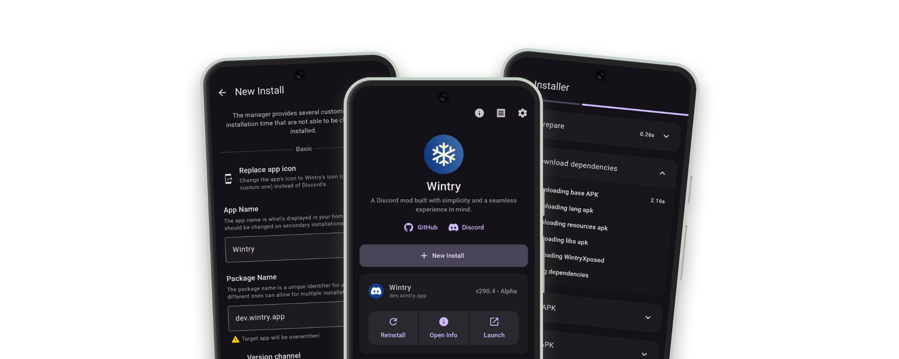

<div align="center">
    
    <h1>Wintry Manager</h1>
    <p>Install <a href="https://github.com/amsyarasyiq/wintry">Wintry</a> on your Android device! Based on Aliucord Manager.</p>

[](https://discord.gg/ybPB5tgD)
[](https://github.com/wtcord/wt-manager/stargazers)
[](https://nightly.link/wtcord/wt-manager/workflows/build/main/app.zip)


[](https://github.com/wtcord/wt-manager/blob/main/LICENSE)

</div>

## Prerequisites

Supported Android versions:

- Android 9 (SDK 28) - Android 16 QPR1 (SDK 36)
- Architectures: arm64, armeabi-v7, x86_64, x86

## Installation

1. Download the [latest release APK](https://github.com/wtcord/wt-manager/releases/latest)
1. Open and install Wintry Manager
    - If you have not enabled "Install from unknown sources" for your browser via system settings, do so now.
1. Open Wintry Manager
1. Grant the permission requests
1. Click "New Install" or "Update" if you have previously installed Wintry.
    - You may change how the Wintry app icon will look once installed.
1. Click "Install" and wait. Do not exit the app while it is running.
    - If a failure occurs, it may be due to a variety of reasons:
        - Poor internet connection
        - Internet censorship / blocks (use a VPN or a different DNS server)
        - Insufficient free storage (at least 500MB is recommended)
   - If you are stuck, please ask for help in the `#support` channel of our [Discord](https://discord.gg/ybPB5tgD).
1. Click "Launch" or directly launch the newly installed Wintry app
1. Sign in to Discord

## Building

1. Install the prerequisites:
    - Git
    - [JDK 21+](https://adoptium.net/temurin/releases/?os=any&arch=any&version=21)
2. Clone the repo:
   ```shell
   git clone https://github.com/wtcord/wt-manager && cd wt-manager
   ```
3. Build the project:
   #### Linux/macOS
   ```shell
   chmod +x gradlew && ./gradlew :app:packageStaging --stacktrace
   ```
   #### Windows
   ```shell
   .\gradlew.bat :app:packageStaging --stacktrace
   ```
4. Built APK will be located at `./app/build/outputs/apk/staging/app-staging.apk`

<!--
## Translations

This project handles crowd-sourced translations through Crowdin! If you happen to be fluent in one of the languages listed below,
then please feel free to contribute your translations!

[](https://crowdin.com/project/aliucord-manager)
<br/><br/>
[](https://crowdin.com/project/aliucord-manager)
-->
